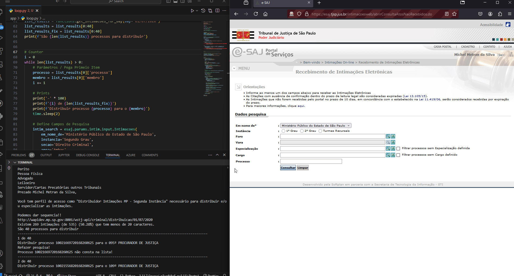

 

O [e-SAJ](https://esaj.tjsp.jus.br/) (_Sistema de Automação da Justiça_) é um
portal
do [Tribunal de Justiça de São Paulo](https://www.tjsp.jus.br/) (TJSP),
desenvolvido
pela [Softplan](https://www.softplan.com.br/), que facilita a troca de
informações e agiliza o trâmite processual. Ele
oferece diversos serviços _online_ voltados para advogados, cidadãos e
serventuários da justiça. Algumas funcionalidades
do e-SAJ incluem:

- **Consulta Processual**: acesso às informações de tramitação dos processos de
  primeiro e segundo grau.
- **Peticionamento Eletrônico**: protocolo e consulta de petições iniciais e
  intermediárias.
- **Diário da Justiça Eletrônico**: consulta aos cadernos das edições
  publicadas.
- **_Push_**: serviço que permite ao advogado receber por e-mail as informações
  sobre a movimentação processual.

 

---

## Pacote

O
pacote [pyESAJ](https://dev.azure.com/mpsp/Informa%C3%A7%C3%B5es%20Estat%C3%ADsticas/_git/pyesaj)
foi desenvolvido para permitir a interação com
o [e-SAJ](https://esaj.tjsp.jus.br/) por meio
do _python_.

Foram utilizados conceitos de _web scraping_, por meio do
_framework_ [Selenium](https://www.selenium.dev/), para interagir com o _Sistema
de Automação da Justiça_, e também
o [Pydantic](https://docs.pydantic.dev/latest/) para validação de objetos,
parâmetros de _input_, parâmetros de pesquisa de processos judiciais, bem como
_outputs_ representados por listas de processos e outros objetos.

Para gerenciamento do projeto e dependências, utilizou-se
o [Poetry](https://python-poetry.org/).

 

---

## Motivação

Em meados de outubro de 2024 o TJSP parou de enviar ao MPSP as intimações da
maneira como vinha e definiu que, a partir de 26.10.2024, as intimações deveria
ser especializadas diretamente no eSAJ. A partir disso, optou-se por utilizar
uma ferramenta de _webscrapping_, seguindo o que um colega já havia feito (em
Java).

Dessa forma foi criado o
_package_ [pyESAJ](https://dev.azure.com/mpsp/Informa%C3%A7%C3%B5es%20Estat%C3%ADsticas/_git/pyesaj),
que faz _webscrappping_ (com _python_) do eSAJ. Abaixo é possível ver o pacote
em funcionamento.

