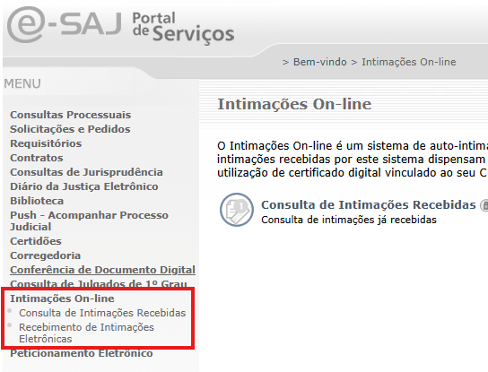

# Intimações

O [TJSP](https://www.tjsp.jus.br/), por meio
do [e-SAJ](https://esaj.tjsp.jus.br/), disponibiliza intimações diariamente para
o [MPSP](https://www.mpsp.mp.br/) se manifestar. Conversando com servidores das
procuradorias, foi explicado que não há qualquer padrão na disponibilização das
intimações: elas podem vir em qualquer horário.

As intimações ficam disponíveis no e-SAJ, para serem recebidas pelo MPSP, por 10
dias sem que se conte o prazo (são os "10 dias de graça"). Nesse período elas
podem ser consultadas em
**_"Recebimento de Intimações Eletrônicas"_** (_link_ [https://esaj.tjsp.jus.br/intimacoesweb/**abrirConsultaAtosNaoRecebidos**.do](https://esaj.tjsp.jus.br/intimacoesweb/abrirConsultaAtosNaoRecebidos.do)).

 

Após isso ocorre o recebimento automático das intimações, o prazo começa a
contar, e as intimações só podem ser acessadas em **_"Consulta de Intimações Recebidas"_** (_link_ [https://esaj.tjsp.jus.br/intimacoesweb/**abrirConsultaAtosRecebidos**.do](https://esaj.tjsp.jus.br/intimacoesweb/abrirConsultaAtosRecebidos.do)).
